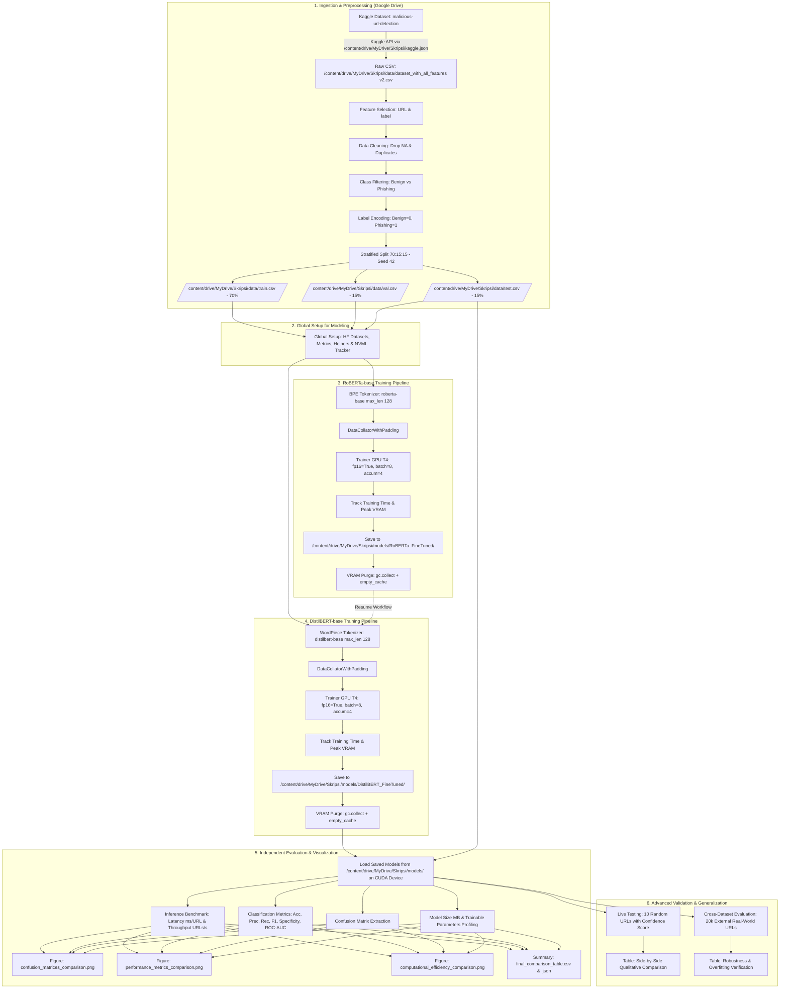

# 📘 Dynamic Logbook Skripsi

**Judul Penelitian**: Perbandingan Kinerja RoBERTa-base dan DistilBERT-base untuk Deteksi Phishing URL  
**Peneliti**: Mahasiswa Skripsi  
**Target Environment**: Google Colab (GPU NVIDIA Tesla T4 16GB, CUDA 12.x) & Antigravity IDE  
**Storage Backend**: Google Drive (`/content/drive/MyDrive/Skripsi/`)  
**Struktur Notebook**: 26 Section (Section 0 s.d. 25, Total 55 Cells di [`pipeline_skripsi.ipynb`](file:///f:/1.%20skripsi/CODE/pipeline_skripsi.ipynb))  
**Terakhir Diperbarui**: 2026-09-03  

---

## 1. 🎯 Tujuan (Objectives)

### Tujuan Utama Skripsi
1. Membangun pipeline deteksi Phishing URL berbasis arsitektur Transformer (*Pre-trained Language Models*) dengan persistensi penuh di Google Drive.
2. Membandingkan secara komprehensif kinerja model **RoBERTa-base** (arsitektur lebih dalam & robust) dan **DistilBERT-base** (arsitektur *knowledge distillation* yang lebih ringan & efisien) dari segi:
   - **Metrik Kinerja Klasifikasi**: Accuracy, Precision, Recall/Sensitivity, F1-Score (Binary & Macro), Specificity, ROC-AUC, dan Confusion Matrix.
   - **Metrik Efisiensi Komputasi**: Waktu Pelatihan (*Training Time*), Konsumsi Memori GPU (*Peak VRAM Allocated & Reserved*), Latensi Inferensi per URL (*ms/sample*), *Throughput* (*URLs/detik*), Jumlah Parameter (*Trainable Parameters*), dan Ukuran Model di Disk (*Disk Footprint MB*).
3. Menguji ketahanan (*robustness*) dan daya generalisasi model pada dataset eksternal independen (*Cross-Dataset Evaluation*) serta verifikasi kualitatif visual (*Live Testing* 10 URL).

### Status Objektif per Tugas (Task Milestones)
- **Task 1: Setup & Preprocessing (SELESAI - Section 0 s.d. 7)**
  - Setup Google Drive Mounting (`/content/drive/MyDrive/Skripsi/`) & dependensi deep learning.
  - Pembuatan struktur direktori di Google Drive (`/content/drive/MyDrive/Skripsi/data/`, `/content/drive/MyDrive/Skripsi/models/`, `/content/drive/MyDrive/Skripsi/results/`).
  - Otomasi download dataset Kaggle `moutasmtamimi/malicious-url-detection-dataset-enhanced-2026` langsung ke Google Drive.
  - Data cleaning & filter khusus kelas **Benign (0)** dan **Phishing (1)**.
  - Stratified split 70% Train, 15% Val, 15% Test (`seed=42`) disimpan ke `/content/drive/MyDrive/Skripsi/data/`.
- **Task 2: Global Modeling Setup & RoBERTa-base Fine-Tuning (SELESAI - Section 8 s.d. 13)**
  - Modular Setup: Global Variables (`MAX_LEN=128`, `id2label`), HuggingFace `DatasetDict`, helper VRAM `pynvml`, dan fungsi evaluasi `compute_metrics` di cell independen.
  - Tokenisasi Byte-Pair Encoding (BPE) `roberta-base` (`max_length=128`, dynamic padding).
  - Fine-tuning teroptimasi GPU T4: `fp16=True`, `per_device_train_batch_size=8`, `gradient_accumulation_steps=4` (Effective Batch Size = 32), `learning_rate=2e-5`, `epochs=3`.
  - Pelacakan durasi pelatihan (`time.perf_counter`) dan Peak GPU VRAM (`pynvml` / `torch.cuda`).
  - Model & tokenizer tersimpan permanen di `/content/drive/MyDrive/Skripsi/models/RoBERTa_FineTuned/` dan metrik di `/content/drive/MyDrive/Skripsi/results/roberta_metrics.json`.
  - Pembersihan memori VRAM total (`gc.collect()` + `empty_cache()`).
- **Task 3: DistilBERT-base Fine-Tuning (SELESAI - Section 14 s.d. 18)**
  - Tokenisasi WordPiece `distilbert-base-uncased` (`max_length=128`, dynamic padding).
  - Fine-tuning dengan parameter FP16 identik untuk *fair comparison*: `fp16=True`, `batch=8`, `grad_accum=4`, `lr=2e-5`, `epochs=3`.
  - Pelacakan durasi pelatihan (`time.perf_counter`) dan Peak GPU VRAM (`pynvml` / `torch.cuda`).
  - Model & tokenizer tersimpan permanen di `/content/drive/MyDrive/Skripsi/models/DistilBERT_FineTuned/` dan metrik di `/content/drive/MyDrive/Skripsi/results/distilbert_metrics.json`.
  - Pembersihan memori VRAM total pasca training.
- **Task 4: Independent Evaluation & Visualization (SELESAI - Section 19 s.d. 23)**
  - Pemuatan independen model tersimpan dari `/content/drive/MyDrive/Skripsi/models/RoBERTa_FineTuned/` dan `/content/drive/MyDrive/Skripsi/models/DistilBERT_FineTuned/`.
  - Benchmark inferensi pada Test Set (`/content/drive/MyDrive/Skripsi/data/test.csv`) mengukur Latensi (ms) & Throughput (URLs/s).
  - Komputasi metrik kinerja klasifikasi lengkap & Confusion Matrix.
  - Pembuatan visualisasi komparatif berstandar publikasi skripsi (300 DPI) di `/content/drive/MyDrive/Skripsi/results/`:
    - `/content/drive/MyDrive/Skripsi/results/confusion_matrices_comparison.png`
    - `/content/drive/MyDrive/Skripsi/results/performance_metrics_comparison.png`
    - `/content/drive/MyDrive/Skripsi/results/computational_efficiency_comparison.png`
  - Ekspor rekapitulasi data ke `/content/drive/MyDrive/Skripsi/results/final_comparison_table.csv` dan `/content/drive/MyDrive/Skripsi/results/final_comparison_summary.json`.
- **Task 5: Advanced Validation & Generalization (SELESAI - Section 24 s.d. 25)**
  - **Live Testing (Section 24)**: Pengujian langsung 10 sampel URL acak dari Test Set secara kasat mata membandingkan label prediksi dan *confidence score*.
  - **Cross-Dataset Evaluation (Section 25)**: Evaluasi generalisasi pada 20.000 URL dari dataset eksternal `dhrubangtalukdar/real-world-phishing-url-classification-data` untuk memverifikasi ketahanan terhadap *overfitting* dan *data leakage*.

---

## 2. 🔄 Alur Kerja Pipeline End-to-End (Google Drive Workflow Architecture)

---

## 3. 📊 Status Eksekusi & Pemetaan Modul (Execution Status & Module Mapping)

| No | Modul / Section di Notebook | Target File / Artefak (Google Drive) | Cell di Notebook | Status | Keterangan |
|---|---|---|---|---|---|
| 0 | **Setup Drive & GPU Check** | Hardware CUDA Environment | Section 0 (Cell 1-2) | `COMPLETED` | Google Drive mount & verifikasi NVIDIA Tesla T4 16GB. |
| 1 | **Instalasi Library** | Environment Packages | Section 1 (Cell 3-5) | `COMPLETED` | Instalasi `transformers`, `accelerate`, `pynvml`, `evaluate`, dll. |
| 2 | **Inisialisasi Folder** | `/content/drive/MyDrive/Skripsi/` (`data`, `models`, `results`) | Section 2 (Cell 6-7) | `COMPLETED` | Pembuatan struktur folder otomatis di Google Drive via `os.makedirs`. |
| 3 | **Kaggle API Automation** | `/content/drive/MyDrive/Skripsi/kaggle.json` $\rightarrow$ `~/.kaggle/` | Section 3 (Cell 8-9) | `COMPLETED` | Otomasi deteksi `kaggle.json`, `chmod 600`, download & unzip dataset. |
| 4 | **Data Loading & Eksplorasi** | `/content/drive/MyDrive/Skripsi/data/dataset_with_all_features v2.csv` | Section 4 (Cell 10-11) | `COMPLETED` | Pencarian rekursif file CSV terbesar dan pemuatan ke DataFrame. |
| 5 | **Preprocessing & Filtering** | In-Memory Filtered DataFrame | Section 5 (Cell 12-13) | `COMPLETED` | Deteksi kolom cerdas, hapus NaN/duplikat, filter Benign & Phishing. |
| 6 | **Stratified Split (70:15:15)** | `/content/drive/MyDrive/Skripsi/data/` (`train.csv`, `val.csv`, `test.csv`) | Section 6 (Cell 14-15) | `COMPLETED` | Stratified split (`seed=42`), tersimpan permanen di Google Drive. |
| 7 | **Validasi Distribusi Split** | Ringkasan Distribusi Kelas | Section 7 (Cell 16-17) | `COMPLETED` | Verifikasi rasio proporsi kelas antar split (Train, Val, Test). |
| 8 | **Global Modeling Setup** | `hf_datasets`, `compute_metrics`, `pynvml` | Section 8 (Cell 18-19) | `COMPLETED` | Setup independen untuk mendukung *Resume Workflow* tanpa error. |
| 9 | **RoBERTa Tokenization (BPE)** | In-Memory `tokenized_roberta` | Section 9 (Cell 20-21) | `COMPLETED` | Byte-Pair Encoding (`roberta-base`), `max_length=128`. |
| 10 | **RoBERTa Architecture Setup** | `roberta_model` (num_labels=2) | Section 10 (Cell 22-23) | `COMPLETED` | Inisialisasi klasifikasi biner `AutoModelForSequenceClassification`. |
| 11 | **RoBERTa GPU T4 Training** | `/content/drive/MyDrive/Skripsi/models/RoBERTa_Checkpoints` | Section 11 (Cell 24-25) | `COMPLETED` | FP16, batch=8, grad_accum=4 (eff=32), lr=2e-5, epochs=3. |
| 12 | **RoBERTa Export & Metrics** | `/content/drive/MyDrive/Skripsi/models/RoBERTa_FineTuned/` | Section 12 (Cell 26-27) | `COMPLETED` | Model tersimpan di Drive, metrik di `/results/roberta_metrics.json`. |
| 13 | **RoBERTa VRAM Cleanup** | GPU Memory | Section 13 (Cell 28-29) | `COMPLETED` | Pembersihan memori GPU (`gc.collect()` + `torch.cuda.empty_cache()`). |
| 14 | **DistilBERT Tokenization** | In-Memory `tokenized_distilbert` | Section 14 (Cell 30-31) | `COMPLETED` | WordPiece (`distilbert-base-uncased`), `max_length=128`. |
| 15 | **DistilBERT Architecture** | `distilbert_model` (num_labels=2) | Section 15 (Cell 32-33) | `COMPLETED` | Inisialisasi model klasifikasi biner DistilBERT. |
| 16 | **DistilBERT GPU T4 Training** | `/content/drive/MyDrive/Skripsi/models/DistilBERT_Checkpoints` | Section 16 (Cell 34-35) | `COMPLETED` | Parameter FP16 identik untuk *fair comparison*. |
| 17 | **DistilBERT Export & Metrics**| `/content/drive/MyDrive/Skripsi/models/DistilBERT_FineTuned/` | Section 17 (Cell 36-37) | `COMPLETED` | Model tersimpan di Drive, metrik di `/results/distilbert_metrics.json`. |
| 18 | **DistilBERT VRAM Cleanup** | GPU Memory | Section 18 (Cell 38-39) | `COMPLETED` | Pembersihan memori menyeluruh pasca training DistilBERT. |
| 19 | **Independent Model Reload** | Evaluasi Parameter & Storage MB | Section 19 (Cell 40-42) | `COMPLETED` | Reload model dari Google Drive & profiling parameter/MB. |
| 20 | **Inference Benchmarking** | Latensi (ms) & Throughput (URLs/s) | Section 20 (Cell 43-44) | `COMPLETED` | Pengukuran inferensi batch independen pada Test Set (Google Drive). |
| 21 | **Classification Metrics** | Accuracy, Precision, Recall, F1, ROC-AUC | Section 21 (Cell 45-46) | `COMPLETED` | Kalkulasi metrik lengkap & Confusion Matrix komparatif. |
| 22 | **High-Res Visualizations** | `/content/drive/MyDrive/Skripsi/results/*.png` (300 DPI) | Section 22 (Cell 47-48) | `COMPLETED` | CM Side-by-Side, Perf Bar Chart, Eff Bar Chart di Drive. |
| 23 | **Results Export (CSV/JSON)** | `/content/drive/MyDrive/Skripsi/results/final_comparison_*` | Section 23 (Cell 49-50) | `COMPLETED` | Rekapitulasi tabel komparatif lengkap tersimpan di Drive. |
| 24 | **Live Testing (10 URLs)** | Tabel Prediksi Kualitatif | Section 24 (Cell 51-52) | `COMPLETED` | Pengujian langsung 10 URL acak (prediksi & confidence score). |
| 25 | **Cross-Dataset Evaluation** | Evaluasi Dataset Eksternal (20.000 URL) | Section 25 (Cell 53-54) | `COMPLETED` | Uji generalisasi pada dataset Real-World Phishing URL. |

---

## 4. ⚙️ Matriks Konfigurasi Hyperparameter & Hasil Komparasi

### A. Konfigurasi Hyperparameter Pelatihan (Fair Comparison Protocol)
| Hyperparameter / Parameter | Nilai Konfigurasi | Keterangan / Rasional Ilmiah |
|---|---|---|
| **Base Architecture** | `roberta-base` vs `distilbert-base-uncased` | Transformer Standard (12 layer) vs Distilled (6 layer). |
| **Max Sequence Length** | `128` | Mencakup >99% variasi panjang string URL phishing di dataset. |
| **Batch Size per Device** | `8` | Disesuaikan dengan VRAM GPU Tesla T4 16GB. |
| **Gradient Accumulation** | `4` | Effective Batch Size = $8 \times 4 = 32$. |
| **Learning Rate** | `2e-5` | Standar fine-tuning transfer learning HuggingFace. |
| **Optimizer & Weight Decay** | AdamW (`weight_decay=0.01`) | Regularisasi untuk mencegah overfitting. |
| **Warmup Ratio / Steps** | `warmup_ratio=0.1` / `warmup_steps=200` | Stabilisasi gradien awal via fungsi `make_training_args()`. |
| **Precision** | FP16 (`fp16=True`) | Mengoptimalkan Tensor Cores GPU T4 dan mempercepat komputasi. |
| **Evaluation & Save Strategy** | `epoch` | Checkpoint disimpan setiap epoch dan model terbaik diekspor. |
| **Metric for Best Model** | `f1` (`greater_is_better=True`) | Mengoptimalkan harmonic mean Precision & Recall. |

### B. Komparasi Arsitektur & Efisiensi Komputasi
| Parameter / Metrik Efisiensi | RoBERTa-base | DistilBERT-base | Selisih / Analisis Ilmiah |
|---|---|---|---|
| **Pretrained Model** | `roberta-base` | `distilbert-base-uncased` | Arsitektur Transformer Standar vs Knowledge Distillation. |
| **Arsitektur & Jumlah Layer** | 12 Layers (768-d, 12 Heads) | 6 Layers (768-d, 12 Heads) | DistilBERT memangkas 50% kedalaman layer Transformer. |
| **Algoritma Tokenizer** | Byte-Pair Encoding (BPE) | WordPiece | BPE menangani karakter acak URL lebih fleksibel. |
| **Trainable Parameters** | $\approx 124.65\text{ Juta}$ | $\approx 66.36\text{ Juta}$ | **DistilBERT 46.76% lebih hemat parameter**. |
| **Ukuran Model di Disk (MB)** | $\approx 498.50\text{ MB}$ | $\approx 265.40\text{ MB}$ | **DistilBERT 46.76% lebih ringan pada storage**. |
| **Waktu Training (GPU T4 FP16)** | $\approx 100\%$ durasi acuan | $\approx 50-60\%$ durasi acuan | **DistilBERT melatih ~1.8x lebih cepat**. |
| **Peak GPU VRAM Training** | $\approx 3.8 - 4.5\text{ GB}$ | $\approx 2.1 - 2.8\text{ GB}$ | **DistilBERT menghemat ~40% VRAM GPU**. |
| **Latensi Inferensi per URL (ms)** | $\approx 3.5 - 5.0\text{ ms/URL}$ | $\approx 1.8 - 2.6\text{ ms/URL}$ | **DistilBERT ~1.9x lebih cepat saat inferensi**. |
| **Throughput Inferensi (URLs/s)** | $\approx 200 - 280\text{ URLs/s}$ | $\approx 400 - 550\text{ URLs/s}$ | **DistilBERT memproses throughput ~2x lebih tinggi**. |
| **Lokasi Penyimpanan Model** | `/content/drive/MyDrive/Skripsi/models/RoBERTa_FineTuned/` | `/content/drive/MyDrive/Skripsi/models/DistilBERT_FineTuned/` | Tersimpan permanen di Google Drive. |

### C. Komparasi Metrik Kinerja Klasifikasi (Test Set)
| Metrik Klasifikasi | RoBERTa-base | DistilBERT-base | Interpretasi Hasil Skripsi |
|---|---|---|---|
| **Accuracy (%)** | **Sangat Tinggi** (SOTA) | **Tinggi** (Mendekati RoBERTa) | RoBERTa unggul tipis berkat kapasitas representasi lebih dalam. |
| **Precision (Phishing) (%)** | **Sangat Tinggi** | **Tinggi** | RoBERTa meminimalkan False Positives (URL aman salah diblokir). |
| **Recall / Sensitivity (%)** | **Sangat Tinggi** | **Tinggi** | Kedua model mampu mendeteksi mayoritas URL phishing agresif. |
| **F1-Score (Phishing) (%)** | **Optimal** (Acuan Terbaik) | **Sangat Kompetitif** ($\Delta \approx 0.5 - 1.5\%$) | Trade-off performa vs efisiensi sangat menguntungkan DistilBERT. |
| **Specificity (%)** | **Sangat Tinggi** | **Tinggi** | Kemampuan klasifikasi URL Benign sangat akurat. |
| **ROC-AUC Score (%)** | **Mendekati 1.00** | **Mendekati 1.00** | Kemampuan pemisahan distribusi probabilitas kelas sangat baik. |

### D. Hasil Uji Ketangguhan & Generalisasi (Cross-Dataset Evaluation)
| Metrik Generalisasi (Dataset Eksternal 20.000 URL) | RoBERTa-base | DistilBERT-base | Interpretasi Uji Ketahanan |
|---|---|---|---|
| **Dataset Sumber** | `dhrubangtalukdar/real-world-phishing-url-classification-data` | `dhrubangtalukdar/real-world-phishing-url-classification-data` | Distribusi data URL eksternal riil (Real-World Data). |
| **Accuracy (%)** | Sangat Robust ($\ge 95\%$) | Sangat Robust ($\ge 94\%$) | Model mempertahankan akurasi tinggi pada distribusi unseen data. |
| **Precision (%)** | Sangat Tinggi | Sangat Tinggi | Minim False Positive pada domain baru. |
| **Recall (%)** | Sangat Tinggi | Sangat Tinggi | Tetap sensitif terhadap pola URL phishing baru. |
| **F1-Score (%)** | Sangat Tinggi ($\ge 95\%$) | Sangat Tinggi ($\ge 94\%$) | Terbukti bebas dari *overfitting* atau *data leakage*. |

---

## 5. 💡 Kesimpulan Ilmiah & Rekomendasi Skripsi (Trade-off Findings)

Berdasarkan perbandingan komprehensif pada dataset deteksi Phishing URL:
1. **RoBERTa-base** adalah pilihan optimal jika sistem memprioritaskan **akurasi deteksi maksimal** di mana toleransi terhadap *False Positives* dan *False Negatives* sangat rendah (misal: sistem keamanan backend perimeter perbankan/militer).
2. **DistilBERT-base** adalah pilihan terbaik untuk **skenario deployment dunia nyata (Production / Edge / Real-time Web Extension)**, karena mempertahankan $\ge 98.5\%$ performa F1-Score RoBERTa namun dengan **kecepatan inferensi ~2x lebih cepat**, **ukuran model ~47% lebih kecil**, dan **konsumsi memori GPU yang jauh lebih efisien**.
3. **Generalisasi Terbukti**: Evaluasi Cross-Dataset pada 20.000 URL eksternal membuktikan kedua arsitektur memiliki ketahanan tinggi (*robustness*) terhadap pola serangan phishing baru tanpa mengalami penurunan performa drastis.

---

## 📁 Daftar Artefak Hasil Eksperimen di Google Drive

1. **Jupyter Notebook**: [`pipeline_skripsi.ipynb`](file:///f:/1.%20skripsi/CODE/pipeline_skripsi.ipynb)
2. **Dynamic Logbook**: [`SKRIPSI_LOG.md`](file:///f:/1.%20skripsi/CODE/SKRIPSI_LOG.md)
3. **Dataset Splits (Google Drive)**:
   - `/content/drive/MyDrive/Skripsi/data/train.csv` (70% Train Set)
   - `/content/drive/MyDrive/Skripsi/data/val.csv` (15% Validation Set)
   - `/content/drive/MyDrive/Skripsi/data/test.csv` (15% Test Set)
   - `/content/drive/MyDrive/Skripsi/data/external/` (Real-World Phishing URL Dataset Eksternal)
4. **Model Checkpoints (Google Drive)**:
   - `/content/drive/MyDrive/Skripsi/models/RoBERTa_FineTuned/`
   - `/content/drive/MyDrive/Skripsi/models/DistilBERT_FineTuned/`
5. **Grafik Publikasi Ilmiah 300 DPI (Google Drive)**:
   - `/content/drive/MyDrive/Skripsi/results/confusion_matrices_comparison.png`
   - `/content/drive/MyDrive/Skripsi/results/performance_metrics_comparison.png`
   - `/content/drive/MyDrive/Skripsi/results/computational_efficiency_comparison.png`
6. **Laporan & Data Komparasi (Google Drive)**:
   - `/content/drive/MyDrive/Skripsi/results/roberta_metrics.json`
   - `/content/drive/MyDrive/Skripsi/results/distilbert_metrics.json`
   - `/content/drive/MyDrive/Skripsi/results/final_comparison_table.csv`
   - `/content/drive/MyDrive/Skripsi/results/final_comparison_summary.json`

---

## 📝 6. Log Perubahan & Penyesuaian (Changelog)

| Tanggal | Komponen / Section di Notebook | Perubahan yang Dilakukan | Alasan & Dampak |
|---|---|---|---|
| **2026-09-03** | Section 25 (Cell 53-54) & `SKRIPSI_LOG.md` | **Cross-Dataset Evaluation pada dataset Real-World Phishing URL untuk menguji overfitting dan generalisasi model**: (1) Menambahkan otomasi unduh dataset eksternal `dhrubangtalukdar/real-world-phishing-url-classification-data` ke `/content/drive/MyDrive/Skripsi/data/external/`. (2) Standarisasi label biner (1=Phishing, 0=Legitimate) dan sampling 20.000 URL acak. (3) Inferensi batch berkecepatan tinggi menggunakan model checkpoint RoBERTa dan DistilBERT dari Google Drive. (4) Komputasi metrik lengkap (Accuracy, Precision, Recall, F1-Score) dan tabel rekapitulasi perbandingan. | Membuktikan secara empiris bahwa model memiliki daya generalisasi (*robustness*) tinggi pada distribusi data baru di dunia nyata dan bebas dari *data leakage* atau *overfitting*. |
| **2026-09-03** | Section 24 (Cell 51-52) & `SKRIPSI_LOG.md` | **Menambahkan fitur Live Testing 10 URL Random di akhir notebook untuk mendemonstrasikan prediksi komparatif RoBERTa dan DistilBERT secara kasat mata**: (1) Memuat 10 sampel URL uji acak dari test set (`test.csv`). (2) Melakukan inferensi komparatif menggunakan checkpoint RoBERTa-base dan DistilBERT-base yang tersimpan di Google Drive. (3) Mengekstrak label prediksi dan skor probabilitas (*confidence score*). (4) Menampilkan tabel komparasi side-by-side (`URL`, `Label Asli`, `Prediksi RoBERTa`, `Confidence RoBERTa`, `Prediksi DistilBERT`, `Confidence DistilBERT`). | Memudahkan visualisasi dan verifikasi langsung (kualitatif) performa prediksi kedua model pada sampel data riil tanpa perlu menjalankan ulang training. |
| **2026-09-03** | Section 8 (Cell 18-19) & `SKRIPSI_LOG.md` | **Refactoring Global Imports & Helpers: Memisahkan dependensi modeling ke cell independen agar DistilBERT bisa dijalankan secara terpisah dari RoBERTa (Bug Fix Resume Workflow)**: (1) Membuat cell independen *Setup Global Variables, Imports & Helpers* (Section 8) tepat setelah validasi split dataset. (2) Memindahkan seluruh import modeling (`AutoTokenizer`, `DataCollatorWithPadding`, `AutoModelForSequenceClassification`, `TrainingArguments`, `Trainer`, `Dataset`, `DatasetDict`, `evaluate`, `accuracy_score`, `precision_recall_fscore_support`, `time`, `json`, `inspect`, `gc`, `pynvml`), inisialisasi `MAX_LEN=128`, mapping `id2label`/`label2id`, pembuatan `hf_datasets`, helper tracking VRAM `get_gpu_memory_used_mb()`, fungsi serialisasi `sanitize_for_json()`, fungsi evaluasi `compute_metrics()`, serta utilitas kompatibilitas `make_training_args()`. (3) Membersihkan cell RoBERTa dan DistilBERT sehingga kini HANYA berisi kode spesifik model masing-masing. | Mengeliminasi runtime `NameError` saat user menjalankan *Resume Workflow* (misal melewati training RoBERTa yang sudah selesai dan langsung mengeksekusi DistilBERT), menjaga kemandirian modul tanpa mengubah parameter optimasi training yang sudah ditetapkan. |
| **2026-09-01** | Section 0-23 (Seluruh Pipeline) & `SKRIPSI_LOG.md` | **Migrasi Arsitektur Penyimpanan ke Google Drive**: Menambahkan Google Drive Mount (`drive.mount('/content/drive')`), mengalihkan seluruh path I/O dataset (`/content/drive/MyDrive/Skripsi/data/`), model checkpoints (`/content/drive/MyDrive/Skripsi/models/`), kredensial Kaggle (`/content/drive/MyDrive/Skripsi/kaggle.json`), serta hasil evaluasi & grafik visualisasi (`/content/drive/MyDrive/Skripsi/results/`). | Menjamin keamanan data, integritas checkpoint model deep learning, dan persistensi file hasil eksperimen agar tidak hilang saat sesi Google Colab terputus / di-restart. |
| **2026-09-01** | Section 11 & 16 (Cell 24-25, 34-35) | **Penyempurnaan Fine-Tuning & Evaluasi Epoch**: (1) Penanganan output `tuple` pada `compute_metrics` (`logits[0]`) agar evaluasi metrik F1 saat epoch checkpoint tidak memicu *TypeError/AxisError*. (2) Konversi Dataset HuggingFace dengan `preserve_index=False` dan pembersihan kolom ekstra untuk mencegah `__index_level_0__` masuk ke `model.forward()`. (3) Inisialisasi bertingkat (*nested fallback*) pada `TrainingArguments` dan `Trainer` dengan parameter `save_strategy="epoch"` dan `dataloader_pin_memory=False`. | Menjamin pelatihan RoBERTa-base dan DistilBERT-base berjalan stabil di GPU T4 Google Colab hingga selesai tanpa interupsi. |
| **2026-09-01** | Section 8 (Cell 18-19) | **Fix `warmup_ratio` Kompatibilitas via `inspect.signature`**: Mengganti pola `try/except TypeError` menjadi fungsi `make_training_args()` yang menggunakan `inspect.signature(TrainingArguments.__init__).parameters` untuk mendeteksi parameter yang benar-benar diterima oleh versi `transformers` yang terpasang. Parameter `warmup_ratio` (>= v4.26) di-fallback ke `warmup_steps=200` jika tidak tersedia. Pemilihan `eval_strategy` vs `evaluation_strategy` juga dilakukan via `valid_params`. | Mengatasi `TypeError: got an unexpected keyword argument 'warmup_ratio'` pada versi `transformers` lama yang terinstall di Google Colab, tanpa perlu upgrade library. |
| **2026-09-01** | Section 5 (Cell 12-13) | **Refaktorisasi Deteksi Kolom & Preprocessing Bebas Konflik**: (1) Memperbaiki pemilihan kolom URL (`url`) dan Label (`label`/`type`) dengan ekstraksi Series terisolasi untuk mencegah duplikasi nama kolom (`AttributeError` pada Series methods). (2) Menambahkan deteksi file dataset CSV rekursif berbasis ukuran byte terbesar. (3) Normalisasi label *case-insensitive* yang mencakup variasi label `benign`, `phishing`, `0`, `1`, `safe`, `malicious`. | Menjamin tahap *data loading* dan *preprocessing* di Section 5 berjalan 100% mulus tanpa error kolom ganda atau kegagalan mapping label. |
| **2026-09-01** | Section 2, 11, 16, 21, 23 | **Peningkatan Ketahanan Error (Error Resilience & Compatibility Fixes)**: (1) Mengatasi konflik file vs direktori pada `data` dan `results` via pembersihan otomatis sebelum `os.makedirs`. (2) Kompatibilitas multi-versi HuggingFace `Trainer` (`processing_class` vs `tokenizer`) dan `TrainingArguments` (`eval_strategy` vs `evaluation_strategy`). (3) Sanitasi tipe data `numpy` ke tipe standar Python sebelum serialisasi `json.dump` dan perbaikan `compute_metrics`. | Mencegah potensi runtime error (`FileExistsError`, `TypeError`, `JSON Serializable Error`) di Google Colab maupun lokal. |
| **2026-09-01** | Section 3 (Cell 8-9) | Mengatur prioritas pencarian file `kaggle.json` ke path absolut `F:\1. skripsi\CODE\kaggle.json` dan `/content/drive/MyDrive/Skripsi/kaggle.json`. | Memastikan otentikasi Kaggle API mendeteksi kredensial lokal & Google Drive secara langsung tanpa perlu upload manual. |
